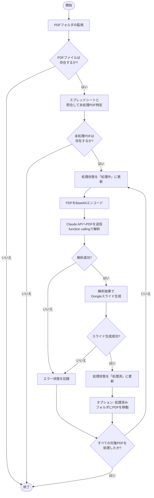
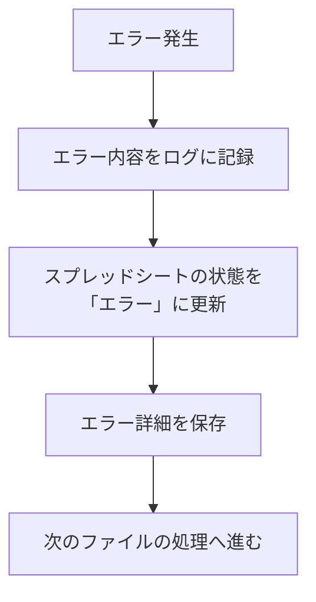
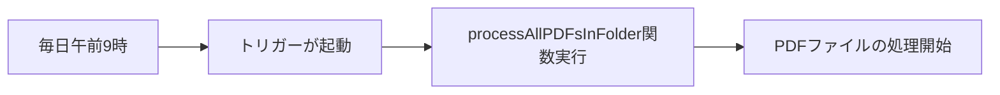
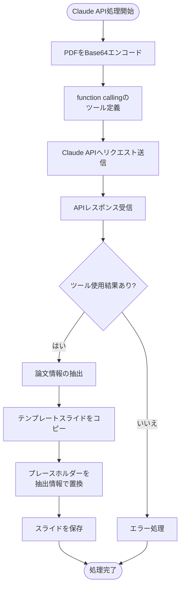

# PDF処理からスライド生成までのフロー（Claude API版）

```mermaid
flowchart TD
    Start([開始]) --> A[PDFフォルダの監視]
    A --> B{PDFファイルは\n存在するか?}
    B -->|いいえ| End([終了])
    B -->|はい| C[スプレッドシートと\n照合して未処理PDF特定]
    
    C --> D{未処理PDFは\n存在するか?}
    D -->|いいえ| End
    D -->|はい| E[処理状態を「処理中」に更新]
    
    E --> F[PDFをBase64エンコード]
    F --> G[Claude APIへPDFを送信\nfunction callingで解析]
    
    G --> H{解析成功?}
    H -->|いいえ| I[エラー状態を記録]
    H -->|はい| J[解析結果で\nGoogleスライド生成]
    
    J --> K{スライド生成成功?}
    K -->|いいえ| I
    K -->|はい| L[処理状態を「処理済」に更新]
    
    L --> M[オプション: 処理済み\nフォルダにPDFを移動]
    M --> N{すべての対象PDFを\n処理したか?}
    N -->|いいえ| E
    N -->|はい| End
    
    I --> N
```

## エラーハンドリングフロー

```mermaid
flowchart TD
    Error[エラー発生] --> A[エラー内容をログに記録]
    A --> B[スプレッドシートの状態を\n「エラー」に更新]
    B --> C[エラー詳細を保存]
    C --> D[次のファイルの処理へ進む]
```

## タイムトリガーの仕組み

```mermaid
flowchart LR
    A[毎日午前9時] --> B[トリガーが起動]
    B --> C[processAllPDFsInFolder関数実行]
    C --> D[PDFファイルの処理開始]
```

## 処理の詳細フロー

```mermaid
flowchart TD
    Start([Claude API処理開始]) --> A[PDFをBase64エンコード]
    A --> B[function callingの\nツール定義]
    B --> C[Claude APIへリクエスト送信]
    C --> D[APIレスポンス受信]
    D --> E{ツール使用結果あり?}
    E -->|はい| F[論文情報の抽出]
    E -->|いいえ| G[エラー処理]
    
    F --> H[テンプレートスライドをコピー]
    H --> I[プレースホルダーを\n抽出情報で置換]
    I --> J[スライドを保存]
    J --> End([処理完了])
    
    G --> End
```
