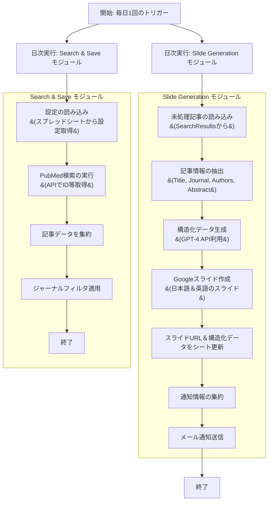

```mermaid
flowchart TD
    A[開始: 毎日1回のトリガー]
    B[日次実行: Search & Save モジュール]
    C[日次実行: Slide Generation モジュール]

    subgraph Slide Generation モジュール
        I[未処理記事の読み込み<br>&#40;SearchResultsから&#41;]
        J[記事情報の抽出<br>&#40;Title, Journal, Authors, Abstract&#41;]
        K[構造化データ生成<br>&#40;GPT-4 API利用&#41;]
        L[Googleスライド作成<br>&#40;日本語＆英語のスライド&#41;]
        M[スライドURL＆構造化データをシート更新]
        N[通知情報の集約]
        O[メール通知送信]
    end

    subgraph Search & Save モジュール
        D[設定の読み込み<br>&#40;スプレッドシートから設定取得&#41;]
        E[PubMed検索の実行<br>&#40;APIでID等取得&#41;]
        F[記事データを集約]
        G[ジャーナルフィルタ適用]
        H[記事をスプレッドシートに保存<br>&#40;SearchResults シート&#41;]
    end
    
    A --> B
    A --> C
    B --> D
    D --> E
    E --> F
    F --> G
    G --> H[終了]
    C --> I
    I --> J
    J --> K
    K --> L
    L --> M
    M --> N
    N --> O
    O --> P[終了]

```